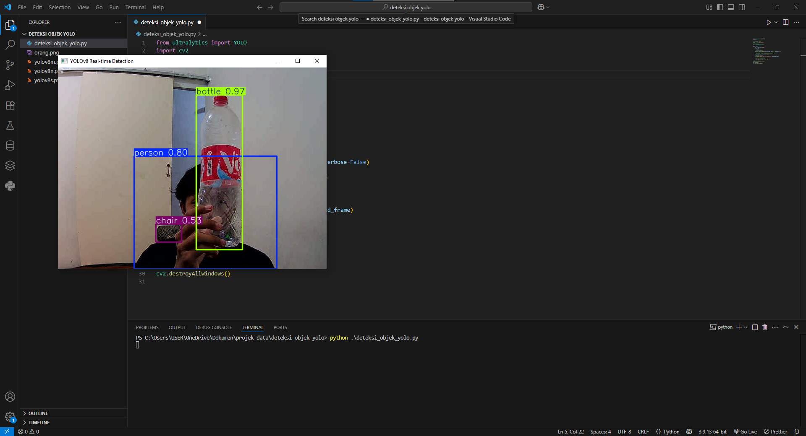

# 🧠 Real-Time Object Detection with YOLOv8 + OpenCV

Proyek ini menggunakan **YOLOv8** dan **OpenCV** untuk mendeteksi objek secara real-time dari webcam.  
Model mendeteksi objek seperti orang, kendaraan, dll langsung pada webcam.

## 🎯 Fitur Utama
- Deteksi objek real-time dari webcam
- Menggunakan model `yolov8n.pt` (pretrained dari Ultralytics)
- Bounding box dan label langsung ditampilkan di layar
- Bisa dikembangkan lebih lanjut dengan custom dataset (fine-tune)

## 🖥️ Demo Output

## 🧩 Teknologi yang Digunakan
- Python
- OpenCV
- [Ultralytics YOLOv8](https://github.com/ultralytics/ultralytics)
- Deep Learning (CNN)
